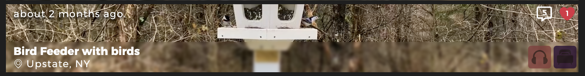

 

<!-- PROJECT LOGO -->
 

<h1 align="center">[soundScapes]</h1>

  

  This app is intended to use for sleeping, studying, or just a distraction. Users can create accounts, post their own <i>soundScapes</i>, follow users, comment, like posts, and more.
     
    <a href="https://soundscapes.johnfarina.co">View Live Demo</a>

<!-- TABLE OF CONTENTS -->

  
Table of Contents

  <ol>
    <li>
      <a href="#about-the-project">About The Project</a>
      <ul>
        <li><a href="#built-with">Built With</a></li>
   <li><a href="#structure">Structure</a></li>
      </ul>
    </li>
    <li>
      <a href="#getting-started">Rails</a>
      <ul>
        <li><a>Models</a></li>
        <li><a>Controller</a></li>
        <li><a>Views</a></li>
      </ul>
    </li>
    <li><a href="#usage">Usage</a></li>
    <li><a href="#contact">Contact</a></li>
  </ol>

<!-- ABOUT THE PROJECT -->
## About The Project
[soundScapes] is a platform for users to share their favorite sounds for Studying, Sleeping, etc. with the community. Users can create, read, update, and delete Soundscapes. As well as following other users, comment on posts, like posts, and create posts.

Each user has their own page where they can see the posts they have created, the posts they have liked, and the users they are following. Additionally, there are three category-specific home pages for easier navigation and a home page with random soundscape suggestions selected by an admin.
 

### Built With
 - Ruby on Rails
 - AWS
 - JavaScript
 - HTML
 - SCSS

### Structure
Here are the main folders I used for this project.

- <a href="">`app/controllers/`</a>
- <a href="">`app/javascript/files/`</a>
- <a href="">`app/views/home_pages/`</a>

## Rails

### Controllers
#### **Home Pages**
The Home Pages are all the same with different parameters, the Main homepage is all the Soundscapes mixed together so all of them, but for studyScapes for example everything on that page needs to have the study tag or else it won't show up. Giving a sense of organization on the site.

#### **Soundscape**
The soundScape Controller manages all interaction for each soundScape, including creating, viewing, and deleting Soundscapes, also allowing users to like and comment on posts and to remove them. The Soundscape model has a relationship with comments and likes through join tables that store user IDs. Each Soundscape can have multiple attachments such as Video, Audio, and Screenshot. Soundscapes can then be properly tagged to the relevant theme after posting a new one.

#### **Users**
The users are being controlled with the `Clearance` gem for the best authentication and security I needed for this project, and added on top of the included Model and Controller.  
Users on soundScapes can Follow other users, like posts and comment, these things are linked to the user. User's likes will show up on their profile to save it for later.  
Users can also edit their Name, Profile Picture, or Profile Banner as well. Without messing with any other value that they do not want to edit.
- Users can follow other users, and see who is following them and who they are following.
- Can like soundScapes to view it at a later point on their profile and also share to their followers what they like.
- Users can edit their profile and change there name, profile picture, and banner.
- Users can also post soundscapes and delete them if they choose to.
- Users can comment on each post.

### Gems
Some of the important gems I used in this project are  
`gem "clearance"` - *Clearance is being used for user authentication for this website* 
`gem 'aws-sdk-s3'` - *AWS SDK is being used to communicate with AWS in a better way with rails*  
`gem 'obscenity'` - *Obscenity is being used to censor any swear words anywhere on the website* 

## Database
For the saved User Images, soundScape videos and all other large files I am using `Rails Action Storage` that links with `AWS S3`. I chose AWS because I find it is the most reliable and easily scalable with not being too expensive if the website ever gets popular.  
For the text database I am using Postgres in production this I found works best with rails and makes it very easy to control and view what I am doing specifically.

## Design

### Intro
for the intro animation I wanted to portray all the sounds that can be posted on soundscapes, so I created a scroll through animation of category names. The category names are on top of each other inside a div that hides all overflow. I then scroll from top to bottom and then reset the animation.  
With a blurred background to put the attention onto the starting animation. *(intro video is randomized with the curated soundscapes)*

### Home Pages
#### Layout
I am going for a rectangular modern design for this website, what I thought would be a good interactive way to lay out the soundscapes on any page.

#### Sound Tiles
The sound tiles are made up from a screenshot of the soundscapes, filling the entirety with the div as the background, then using a blur to push it more back.
I show two icons on the top right showing the like and comment count for each post, having the category icons right below that data. These icons show which category these sounds where placed in from the 3.

### User Pages
The user pages have a banner that shows the user profile picture and profile banner, as well as showing who the user is following or followed.

The User page body shows which soundscapes they have liked for ease of use to come back to a sound you listened too previously, And to show the soundscapes that this user has posted.

### [soundScapes]
The soundscapes are designed with the video as the background which fills the screen at any size, and a play and pause tab on the top right.
<!-- image -->
The Information, Comments, and Likes are all stored on the tab on the bottom, as styled in a minimalist way, with the blurred background with white.

<!-- USAGE EXAMPLES -->

## Usage

Find one of your favorite sounds and keep it on in the background to focus. You can also create an account to save the sounds that you like, or follow users who post good sounds.
 
 

<!-- CONTACT -->
## Contact

**John Farina** - johnfarina8@gmail.com

My Website: [johnfarina.co](https://johnfarina.co)

Project Link: [github.com/john-farina/sleepScapes](https://github.com/john-farina/sleepScapes)

(<a href="#readme-top">back to top</a>)

